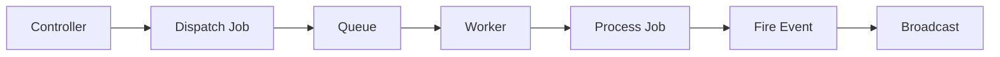

## Laravel Application Structure

EduStack Smart follows Laravel's conventional directory structure with domain-specific organization.

### Directory Overview

```
app/
├── Console/
│   └── Commands/          # Artisan commands
├── Events/                # Event classes
├── Http/
│   ├── Controllers/       # Request handlers
│   ├── Middleware/        # HTTP middleware
│   ├── Requests/          # Form request validation
│   └── Resources/         # API resource transformers
├── Models/                # Eloquent models (21 models)
├── Notifications/         # Notification classes
└── Providers/             # Service providers
```

<Info>
The application contains 29 controllers and 21 models, organized by domain (Auth, Admin, Member, User).
</Info>

## MVC Pattern Implementation

### Controllers

Controllers are organized by role and feature domain:

```
app/Http/Controllers/
├── API/
│   └── ApiBlogController.php
├── Admin/
│   ├── AdminUserRoleController.php
│   ├── AdminUserStatusController.php
│   └── AdminUsersController.php
├── Auth/
│   ├── AuthenticatedSessionController.php
│   ├── EmailVerificationController.php
│   ├── RegisteredUserController.php
│   └── ...
├── Member/
│   ├── Blog/
│   │   ├── BlogController.php
│   │   ├── PostCategoryController.php
│   │   ├── PostContentController.php
│   │   └── PostStatusController.php
│   └── Event/
│       ├── EventController.php
│       ├── EventContentController.php
│       └── EventStatusController.php
└── User/
    └── Project/
        ├── ProjectController.php
        ├── ProjectCollaboratorsController.php
        ├── ProjectContentController.php
        └── ProjectStatusController.php
```

### Controller Example

From `app/Http/Controllers/Member/Blog/BlogController.php:18`:

```php
public function index(Request $request)
{
    $search = $request->string('search', '');
    $page = $request->integer('page', 1);
    $category = $request->query('category', null);
    $type = $request->query('type', null);

    $posts = $request->user()
        ->posts()
        ->when(
            $search,
            fn($query, $search) =>
            $query->where('name', 'like', "%{$search}%")
        )
        ->when(
            $category,
            fn($query, $category) =>
            $query->whereHas('categories', function ($query) use ($category) {
                $query->where('post_category_id', $category);
            })
        )
        ->when(
            $type,
            fn($query, $type) =>
            $query->where('post_type_id', $type)
        )
        ->orderBy('id', 'desc')
        ->with(['type', 'categories', 'media'])
        ->paginate(20);

    $types = PostType::all();
    $categories = PostCategory::all();

    return Inertia::render('member/blog/blog', [
        'posts' => new PostCollection($posts),
        'types' => $types,
        'categories' => $categories,
        'category' => $request->integer('category'),
        'type' => $request->integer('type'),
        'page' => $page,
        'search' => $search,
        'message' => $request->session()->get('message'),
    ]);
}
```

<Accordion title="Key Features of This Controller">
  - **Type-safe parameters** using `$request->string()` and `$request->integer()`
  - **Conditional queries** using `when()` for flexible filtering
  - **Eager loading** with `with()` to prevent N+1 queries
  - **Pagination** with 20 items per page
  - **Resource transformation** using `PostCollection`
  - **Inertia rendering** for seamless React integration
</Accordion>

### Models

Models use Eloquent ORM with additional packages for enhanced functionality.

From `app/Models/Post.php:14`:

```php
class Post extends Model implements HasMedia
{
    use HasSlug, InteractsWithMedia;
    
    protected $fillable = [
        'name',
        'slug',
        'summary',
        'content',
        'views_count',
        'is_featured',
        'is_published',
        'published_at',
        'post_type_id',
        'user_id',
    ];

    protected function casts(): array
    {
        return [
            'content' => 'array',
            'is_published' => 'boolean',
            'is_featured' => 'boolean',
        ];
    }

    public function getSlugOptions(): SlugOptions
    {
        return SlugOptions::create()
            ->generateSlugsFrom('name')
            ->saveSlugsTo('slug');
    }

    public function author()
    {
        return $this->belongsTo(User::class, 'user_id');
    }

    public function type()
    {
        return $this->belongsTo(PostType::class, 'post_type_id');
    }

    public function categories()
    {
        return $this->belongsToMany(PostCategory::class, 'category_posts', 'post_id', 'post_category_id')
            ->withPivot('id');
    }
}
```

<CardGroup cols={2}>
  <Card title="Spatie Sluggable" icon="link">
    Automatically generates URL-friendly slugs from the name field
  </Card>
  
  <Card title="Spatie Media Library" icon="image">
    Handles file uploads, conversions, and responsive images
  </Card>
  
  <Card title="Eloquent Casts" icon="code">
    JSON content stored as array, booleans for flags
  </Card>
  
  <Card title="Relationships" icon="diagram-project">
    BelongsTo, BelongsToMany with pivot data
  </Card>
</CardGroup>

### User Model

From `app/Models/User.php:13`:

```php
class User extends Authenticatable implements MustVerifyEmail
{
    use HasFactory, Notifiable, TwoFactorAuthenticatable, HasApiTokens, HasRoles;

    protected $fillable = [
        'name',
        'father_last_name',
        'mother_last_name',
        'email',
        'password',
        'is_active',
    ];

    protected $hidden = [
        'password',
        'remember_token',
        'two_factor_confirmed_at',
        'two_factor_recovery_codes',
        'two_factor_secret',
    ];

    protected function casts(): array
    {
        return [
            'email_verified_at' => 'datetime',
            'password' => 'hashed',
            'is_active' => 'boolean',
        ];
    }

    public function isActive(): bool
    {
        return $this->is_active;
    }

    public function posts()
    {
        return $this->hasMany(Post::class);
    }

    public function events()
    {
        return $this->hasMany(Event::class);
    }

    public function projects()
    {
        return $this->hasMany(Project::class);
    }

    public function projectsCollaborations()
    {
        return $this->belongsToMany(Project::class, 'project_collaborators', 'user_id', 'project_id')
            ->withPivot('id');
    }
}
```

<Info>
The User model integrates five traits: Factory, Notifiable, Two-Factor Authentication, API Tokens, and Role-based permissions.
</Info>

## Routing Architecture

### Route Organization

Routes are split across multiple files for better organization:

```
routes/
├── api.php              # API endpoints
├── auth.php             # Authentication routes
├── channels.php         # Broadcasting channels
├── console.php          # Artisan commands
├── settings.php         # Settings routes
├── web.php              # Main web routes
└── roles/
    ├── admin.php        # Admin-specific routes
    ├── inactive.php     # Inactive user routes
    ├── member.php       # Member routes
    ├── student.php      # Student routes
    └── teacher.php      # Teacher routes
```

### Web Routes

From `routes/web.php:19`:

```php
Route::get('/', function () {
    return Inertia::render('welcome');
})->name('home');

Route::middleware([
    'auth',
    'verified',
    'active',
])->group(function () {
    Route::get('dashboard', function () {
        return Inertia::render('dashboard');
    })->name('dashboard');
});

require __DIR__.'/settings.php';
require __DIR__.'/auth.php';
require __DIR__.'/roles/student.php';
require __DIR__.'/roles/member.php';
require __DIR__.'/roles/teacher.php';
require __DIR__.'/roles/admin.php';
require __DIR__.'/roles/inactive.php';
```

### Role-Based Routes

From `routes/roles/member.php:8`:

```php
Route::middleware([
    'auth',
    'verified',
    'active',
    'role:member|admin'
])->group(function () {
    Route::resource('events', EventController::class);

    Route::get('events/{event}/content/edit', 
        [EventContentController::class, 'edit'])
        ->name('events.content.edit');
    Route::patch('events/{event}/content', 
        [EventContentController::class, 'update'])
        ->name('events.content.update');
    Route::patch('events/{event}/status', 
        EventStatusController::class)
        ->name('events.status');
});
```

<Note>
Middleware stack ensures authentication, email verification, active account status, and role permissions.
</Note>

### API Routes

From `routes/api.php:7`:

```php
Route::get('/user', function (Request $request) {
    return $request->user();
})->middleware('auth:sanctum');

Route::get('/blog', ApiBlogController::class)->name('api.blog');
```

## Middleware

Custom middleware extends Laravel's functionality:

### Handle Inertia Requests

From `app/Http/Middleware/HandleInertiaRequests.php:37`:

```php
public function share(Request $request): array
{
    [$message, $author] = str(Inspiring::quotes()->random())->explode('-');

    return [
        ...parent::share($request),
        'name' => config('app.name'),
        'quote' => ['message' => trim($message), 'author' => trim($author)],
        'auth' => [
            'user' => $request->user()?->load('roles'),
        ],
        'sidebarOpen' => ! $request->hasCookie('sidebar_state') 
            || $request->cookie('sidebar_state') === 'true',
    ];
}
```

This middleware shares global data with every Inertia response:
- Application name
- Inspirational quote
- Authenticated user with roles
- Sidebar state from cookie

### Active Account Middleware

From `app/Http/Middleware/ActiveAccount.php`:

Ensures only active users can access protected routes. Inactive users are redirected to a specific page.

### Available Middleware

```
app/Http/Middleware/
├── ActiveAccount.php        # Verify user is active
├── HandleAppearance.php     # Theme preference
├── HandleInertiaRequests.php # Share data with frontend
└── Inactive.php             # Routes for inactive users
```

## Event-Driven Architecture

### Event Classes

From `app/Events/MediaProcessed.php:13`:

```php
class MediaProcessed implements ShouldBroadcast
{
    use Dispatchable, InteractsWithSockets, SerializesModels;

    public function __construct(public $model_id, public $model_type)
    {
        //
    }

    public function broadcastOn(): array
    {
        return [
            new PrivateChannel($this->model_type . '.' . $this->model_id),
        ];
    }

    public function broadcastWith(): array
    {
        return [
            'id' => $this->model_id,
            'type' => $this->model_type,
            'message' => 'Procesamiento de ' . $this->model_type . ' completado.',
        ];
    }
}
```

### Event Listeners

From `app/Providers/AppServiceProvider.php:30`:

```php
Event::listen(ConversionHasBeenCompletedEvent::class, function ($event) {
    $media = $event->media;

    if ($media->model_type === Post::class) {
        broadcast(new MediaProcessed($media->model_id, 'post'));
    }

    if ($media->model_type === Project::class) {
        broadcast(new MediaProcessed($media->model_id, 'project'));
    }

    if ($media->model_type === Event::class) {
        broadcast(new MediaProcessed($media->model_id, 'event'));
    }
});
```

<Steps>
  <Step title="File Upload">
    User uploads media file through Spatie Media Library
  </Step>
  
  <Step title="Queue Processing">
    Media conversion queued for background processing
  </Step>
  
  <Step title="Event Fired">
    `ConversionHasBeenCompletedEvent` fired when conversion completes
  </Step>
  
  <Step title="Broadcast">
    `MediaProcessed` event broadcast via WebSocket to private channel
  </Step>
  
  <Step title="Client Update">
    React frontend receives event and updates UI in real-time
  </Step>
</Steps>

## API Resource Transformers

Resources provide consistent data transformation for API responses.

### Post Resource

From `app/Http/Resources/PostResource.php`:

```php
class PostResource extends JsonResource
{
    public function toArray(Request $request): array
    {
        return [
            'id' => $this->id,
            'name' => $this->name,
            'slug' => $this->slug,
            'summary' => $this->summary,
            'content' => $this->content,
            'is_published' => $this->is_published,
            'is_featured' => $this->is_featured,
            'published_at' => $this->published_at,
            'created_at' => $this->created_at,
            'updated_at' => $this->updated_at,
            'type' => $this->whenLoaded('type'),
            'categories' => $this->whenLoaded('categories'),
            'media' => MediaResource::collection($this->whenLoaded('media')),
            'author' => $this->whenLoaded('author'),
        ];
    }
}
```

### Media Resource

From `app/Http/Resources/MediaResource.php`:

```php
class MediaResource extends JsonResource
{
    public function toArray(Request $request): array
    {
        return [
            'id' => $this->id,
            'urls' => $this->getUrls(),
            'dimensions' => $this->getDimensions(),
            'responsive' => $this->getResponsiveImages(),
            'is_processed' => $this->hasGeneratedConversion('main'),
            'custom_properties' => $this->custom_properties,
        ];
    }
}
```

<Accordion title="Resource Benefits">
  - **Consistent structure** across all API responses
  - **Conditional loading** with `whenLoaded()`
  - **Nested resources** for related data
  - **Type safety** when paired with TypeScript
  - **Easy maintenance** - change once, apply everywhere
</Accordion>

## Queue System

### Configuration

From `config/queue.php`:

```php
'default' => env('QUEUE_CONNECTION', 'database'),
```

The application uses database-driven queues by default:
- Simple setup, no additional services required
- Jobs stored in `jobs` table
- Failed jobs tracked in `failed_jobs` table

### Queue Usage



Common queued operations:
- Media file conversions
- Email sending
- Notification dispatching
- Data export generation

### Running Queue Workers

From `composer.json:70`:

```json
"dev": [
    "npx concurrently ... \"php artisan queue:listen --tries=1\" ..."
]
```

Development mode runs a queue listener automatically.

## Authentication & Authorization

### Laravel Fortify

Handles authentication features:
- User registration
- Login/logout
- Email verification
- Password reset
- Two-factor authentication

### Laravel Sanctum

Provides API authentication:
- Token-based authentication
- SPA authentication
- Mobile app support

### Spatie Permission

Role-based access control:

From `app/Models/User.php:16`:
```php
use HasRoles;
```

Middleware usage in routes:
```php
Route::middleware(['role:member|admin'])->group(function () {
    // Protected routes
});
```

## Service Providers

### AppServiceProvider

From `app/Providers/AppServiceProvider.php:26`:

```php
public function boot(): void
{
    JsonResource::withoutWrapping();

    Event::listen(ConversionHasBeenCompletedEvent::class, function ($event) {
        // Handle media processing events
    });
}
```

Key configurations:
- Disable JSON resource wrapping for cleaner responses
- Register event listeners
- Bootstrap application services

## Broadcasting with Reverb

From `composer.json:18`:
```json
"laravel/reverb": "^1.0",
"pusher/pusher-php-server": "^7.2",
```

Laravel Reverb provides:
- WebSocket server built for Laravel
- Private and presence channels
- Real-time event broadcasting
- Integration with Laravel Echo on frontend

## Validation

Form Request validation from `app/Http/Controllers/Member/Blog/BlogController.php:79`:

```php
public function store(Request $request)
{
    $data = $request->validate([
        'name' => ['required', 'string', 'max:255'],
        'summary' => ['required', 'string', 'min:100'],
        'images' => ['required', 'array', 'min:1', 'max:20'],
        'images.*' => ['required', 'image', 'mimes:jpg,png,jpeg,webp'],
        'post_type_id' => ['required', 'integer', 'exists:post_types,id'],
        'categories' => ['array', 'required', 'min:1'],
        'categories.*' => ['required', 'integer', 'exists:post_categories,id'],
    ]);
    
    // Create post and handle media
}
```

<CardGroup cols={2}>
  <Card title="Type Validation" icon="check">
    String, integer, array, boolean validation
  </Card>
  
  <Card title="Size Constraints" icon="ruler">
    Min/max length, file size limits
  </Card>
  
  <Card title="Existence Checks" icon="database">
    Foreign key validation with `exists` rule
  </Card>
  
  <Card title="File Validation" icon="file">
    MIME types, dimensions, size limits
  </Card>
</CardGroup>

## Best Practices

<AccordionGroup>
  <Accordion title="Controller Responsibilities">
    - Keep controllers thin
    - Validate input
    - Delegate to services for complex logic
    - Return Inertia responses or redirects
  </Accordion>
  
  <Accordion title="Model Design">
    - Use Eloquent relationships
    - Define casts for type safety
    - Implement interfaces for polymorphic behavior
    - Keep business logic in models
  </Accordion>
  
  <Accordion title="Route Organization">
    - Group by authentication requirements
    - Split by role/permission
    - Use resource routes for CRUD
    - Name all routes for type-safe routing
  </Accordion>
  
  <Accordion title="Event Usage">
    - Use for cross-cutting concerns
    - Broadcast for real-time updates
    - Queue listeners for heavy operations
    - Keep events simple and focused
  </Accordion>
</AccordionGroup>

## Related Documentation

<CardGroup cols={2}>
  <Card title="Frontend Architecture" icon="react" href="/architecture/frontend">
    Learn how React components consume backend data
  </Card>
  
  <Card title="Database Schema" icon="database" href="/architecture/database">
    Explore database structure and relationships
  </Card>
</CardGroup>