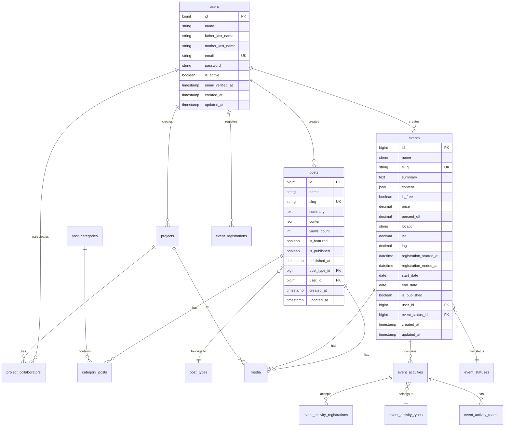

## Database Overview

EduStack Smart uses a relational database (MySQL/PostgreSQL) with a well-structured schema supporting educational content management, events, projects, and user collaboration.

<Info>
The application contains 21 Eloquent models and 30 migrations, implementing a normalized database design with proper foreign key constraints.
</Info>

## Database Configuration

From `config/database.php`, the application supports multiple database connections:

- **MySQL** - Primary database (default)
- **PostgreSQL** - Alternative relational database
- **SQLite** - Testing and development

## Core Models

The application has 21 models organized by domain:

```
app/Models/
├── User.php
├── Post.php
├── PostType.php
├── PostCategory.php
├── CategoryPost.php
├── Project.php
├── ProjectCollaborator.php
├── Event.php
├── EventStatus.php
├── EventActivity.php
├── EventActivityType.php
├── EventActivityCategory.php
├── EventActivityRegistration.php
├── EventActivityTeam.php
├── EventActivityTeamMember.php
├── EventCollaborator.php
├── EventRegistration.php
├── ActivityCategory.php
├── CompetitionRound.php
├── CompetitionRoundExercise.php
└── DifficultyLevel.php
```

## Entity Relationship Diagram



## User Model

### Schema

From `database/migrations/0001_01_01_000000_create_users_table.php`:

```php
Schema::create('users', function (Blueprint $table) {
    $table->id();
    $table->string('name');
    $table->string('father_last_name');
    $table->string('mother_last_name');
    $table->string('email')->unique();
    $table->timestamp('email_verified_at')->nullable();
    $table->string('password');
    $table->boolean('is_active')->default(true);
    $table->rememberToken();
    $table->timestamps();
});
```

### Model Relationships

From `app/Models/User.php:65`:

```php
public function posts()
{
    return $this->hasMany(Post::class);
}

public function events()
{
    return $this->hasMany(Event::class);
}

public function projects()
{
    return $this->hasMany(Project::class);
}

public function projectsCollaborations()
{
    return $this->belongsToMany(
        Project::class,
        'project_collaborators',
        'user_id',
        'project_id'
    )->withPivot('id');
}
```

<CardGroup cols={2}>
  <Card title="Has Many" icon="arrow-right">
    User creates multiple posts, events, and projects
  </Card>
  
  <Card title="Belongs To Many" icon="arrows-left-right">
    User collaborates on projects through pivot table
  </Card>
  
  <Card title="Traits" icon="puzzle-piece">
    HasFactory, Notifiable, TwoFactorAuthenticatable, HasApiTokens, HasRoles
  </Card>
  
  <Card title="Authentication" icon="lock">
    Implements MustVerifyEmail interface
  </Card>
</CardGroup>

### Additional User Tables

From migrations:

```php
// Two-factor authentication columns
$table->text('two_factor_secret')->nullable();
$table->text('two_factor_recovery_codes')->nullable();
$table->timestamp('two_factor_confirmed_at')->nullable();

// Personal access tokens for API
Schema::create('personal_access_tokens', function (Blueprint $table) {
    $table->id();
    $table->morphs('tokenable');
    $table->string('name');
    $table->string('token', 64)->unique();
    $table->text('abilities')->nullable();
    $table->timestamp('last_used_at')->nullable();
    $table->timestamp('expires_at')->nullable();
    $table->timestamps();
});
```

## Post Model

### Schema

From `database/migrations/2025_12_14_213446_create_posts_table.php:14`:

```php
Schema::create('posts', function (Blueprint $table) {
    $table->id();
    $table->string('name');
    $table->string('slug')->unique();
    $table->text('summary');
    $table->json('content');
    $table->unsignedInteger('views_count')->default(0);
    $table->boolean('is_featured')->default(false);
    $table->boolean('is_published')->default(false)->index();
    $table->timestamp('published_at')->nullable();
    $table->foreignId('post_type_id')->nullable()->constrained()->nullOnDelete();
    $table->foreignId('user_id')->constrained()->cascadeOnDelete();
    $table->timestamps();
});
```

<Accordion title="Schema Features">
  - **Unique slug** for SEO-friendly URLs
  - **JSON content** for flexible page builder data
  - **Views counter** for analytics
  - **Publication flags** with timestamp
  - **Foreign keys** with appropriate cascade/null behavior
  - **Index** on `is_published` for filtering queries
</Accordion>

### Post Categories (Many-to-Many)

```php
// Post categories table
Schema::create('post_categories', function (Blueprint $table) {
    $table->id();
    $table->string('name');
    $table->string('slug')->unique();
    $table->timestamps();
});

// Pivot table
Schema::create('category_posts', function (Blueprint $table) {
    $table->id();
    $table->foreignId('post_id')->constrained()->cascadeOnDelete();
    $table->foreignId('post_category_id')->constrained()->cascadeOnDelete();
    $table->timestamps();
    
    $table->unique(['post_id', 'post_category_id']);
});
```

### Post Model Relationships

From `app/Models/Post.php:65`:

```php
public function author()
{
    return $this->belongsTo(User::class, 'user_id');
}

public function type()
{
    return $this->belongsTo(PostType::class, 'post_type_id');
}

public function categories()
{
    return $this->belongsToMany(
        PostCategory::class,
        'category_posts',
        'post_id',
        'post_category_id'
    )->withPivot('id');
}
```

### Media Library Integration

From `app/Models/Post.php:45`:

```php
public function registerMediaCollections(): void
{
    $this->addMediaCollection('gallery')
        ->useDisk('s3');
}

public function registerMediaConversions(?Media $media = null): void
{
    $this->addMediaConversion('hero')
        ->fit(Fit::Crop, 1920, 1080)
        ->quality(85)
        ->sharpen(10);

    $this->addMediaConversion('main')
        ->fit(Fit::Crop, 1200, 620)
        ->quality(85)
        ->sharpen(10)
        ->withResponsiveImages();
}
```

<Info>
Media files are stored on AWS S3 with automatic image conversions: hero size (1920x1080) and main size (1200x620) with responsive variants.
</Info>

## Event Model

### Schema

From `database/migrations/2026_01_05_033735_create_events_table.php:13`:

```php
Schema::create('events', function (Blueprint $table) {
    $table->id();
    $table->string('name');
    $table->string('slug')->unique();
    $table->text('summary');
    $table->json('content');
    $table->boolean('is_free')->default(false);
    $table->decimal('price', 10, 2)->default(0);
    $table->decimal('percent_off', 5, 2)->default(0);
    $table->string('location');
    $table->decimal('lat', 10, 8);
    $table->decimal('lng', 11, 8);
    $table->dateTime('registration_started_at')->index();
    $table->dateTime('registration_ended_at');
    $table->date('start_date')->index();
    $table->date('end_date');
    $table->boolean('is_published')->default(false);
    $table->foreignId('user_id')->constrained()->cascadeOnDelete();
    $table->timestamps();
});
```

### Event Features

<CardGroup cols={2}>
  <Card title="Pricing" icon="dollar-sign">
    Free/paid events with discount percentages
  </Card>
  
  <Card title="Location" icon="map-pin">
    Geographic coordinates for map integration
  </Card>
  
  <Card title="Registration" icon="calendar">
    Time windows for registration period
  </Card>
  
  <Card title="Duration" icon="clock">
    Start and end dates with indexes for queries
  </Card>
</CardGroup>

### Event Relationships

From `app/Models/Event.php:77`:

```php
public function author()
{
    return $this->belongsTo(User::class, 'user_id');
}

public function activities()
{
    return $this->hasMany(EventActivity::class);
}

public function status()
{
    return $this->belongsTo(EventStatus::class, 'event_status_id');
}
```

### Event Activities

Events can have multiple activities (workshops, competitions, etc.):

```php
Schema::create('event_activities', function (Blueprint $table) {
    $table->id();
    $table->string('name');
    $table->string('slug')->unique();
    $table->text('summary');
    $table->json('content');
    $table->string('location');
    $table->decimal('lat', 10, 8);
    $table->decimal('lng', 11, 8);
    $table->boolean('is_online')->default(false);
    $table->string('online_link')->nullable();
    $table->boolean('is_a_team_event')->default(false);
    $table->integer('min_team_size')->nullable();
    $table->integer('max_team_size')->nullable();
    $table->boolean('is_a_full_team_event')->default(false);
    $table->integer('max_participants')->nullable();
    $table->boolean('only_students')->default(false);
    $table->boolean('is_competition')->default(false);
    $table->integer('participants_per_round')->nullable();
    $table->boolean('is_published')->default(false);
    $table->timestamp('published_at')->nullable();
    $table->dateTime('started_at');
    $table->dateTime('ended_at');
    $table->foreignId('event_id')->constrained()->cascadeOnDelete();
    $table->foreignId('event_activity_type_id')->constrained()->cascadeOnDelete();
    $table->timestamps();
});
```

## Project Model

### Schema

```php
Schema::create('projects', function (Blueprint $table) {
    $table->id();
    $table->string('name');
    $table->string('slug')->unique();
    $table->text('summary');
    $table->json('content');
    $table->string('repository_url')->nullable();
    $table->string('demo_url')->nullable();
    $table->json('tech_stack');
    $table->string('version')->default('1.0.0');
    $table->string('license')->nullable();
    $table->boolean('is_featured')->default(false);
    $table->boolean('is_published')->default(false);
    $table->timestamp('published_at')->nullable();
    $table->foreignId('user_id')->constrained()->cascadeOnDelete();
    $table->timestamps();
});
```

### Project Collaborators

```php
Schema::create('project_collaborators', function (Blueprint $table) {
    $table->id();
    $table->foreignId('project_id')->constrained()->cascadeOnDelete();
    $table->foreignId('user_id')->constrained()->cascadeOnDelete();
    $table->timestamps();
    
    $table->unique(['project_id', 'user_id']);
});
```

## Spatie Media Library

The application uses Spatie Media Library for file management:

```php
Schema::create('media', function (Blueprint $table) {
    $table->id();
    $table->morphs('model');
    $table->uuid('uuid')->nullable()->unique();
    $table->string('collection_name');
    $table->string('name');
    $table->string('file_name');
    $table->string('mime_type')->nullable();
    $table->string('disk');
    $table->string('conversions_disk')->nullable();
    $table->unsignedBigInteger('size');
    $table->json('manipulations');
    $table->json('custom_properties');
    $table->json('generated_conversions');
    $table->json('responsive_images');
    $table->unsignedInteger('order_column')->nullable()->index();
    $table->timestamps();
});
```

<Note>
Polymorphic relationship allows any model (Post, Event, Project) to have media attachments.
</Note>

## Spatie Permission Tables

Role-based access control tables:

```php
// Roles
Schema::create('roles', function (Blueprint $table) {
    $table->id();
    $table->string('name');
    $table->string('guard_name');
    $table->timestamps();
    $table->unique(['name', 'guard_name']);
});

// Permissions
Schema::create('permissions', function (Blueprint $table) {
    $table->id();
    $table->string('name');
    $table->string('guard_name');
    $table->timestamps();
    $table->unique(['name', 'guard_name']);
});

// Model has roles
Schema::create('model_has_roles', function (Blueprint $table) {
    $table->unsignedBigInteger('role_id');
    $table->string('model_type');
    $table->unsignedBigInteger('model_id');
    $table->index(['model_id', 'model_type']);
    $table->primary(['role_id', 'model_id', 'model_type']);
});

// Model has permissions
Schema::create('model_has_permissions', function (Blueprint $table) {
    $table->unsignedBigInteger('permission_id');
    $table->string('model_type');
    $table->unsignedBigInteger('model_id');
    $table->index(['model_id', 'model_type']);
    $table->primary(['permission_id', 'model_id', 'model_type']);
});

// Role has permissions
Schema::create('role_has_permissions', function (Blueprint $table) {
    $table->unsignedBigInteger('permission_id');
    $table->unsignedBigInteger('role_id');
    $table->primary(['permission_id', 'role_id']);
});
```

## Queue and Cache Tables

### Jobs Table

```php
Schema::create('jobs', function (Blueprint $table) {
    $table->id();
    $table->string('queue')->index();
    $table->longText('payload');
    $table->unsignedTinyInteger('attempts');
    $table->unsignedInteger('reserved_at')->nullable();
    $table->unsignedInteger('available_at');
    $table->unsignedInteger('created_at');
});

Schema::create('job_batches', function (Blueprint $table) {
    $table->string('id')->primary();
    $table->string('name');
    $table->integer('total_jobs');
    $table->integer('pending_jobs');
    $table->integer('failed_jobs');
    $table->longText('failed_job_ids');
    $table->mediumText('options')->nullable();
    $table->integer('cancelled_at')->nullable();
    $table->integer('created_at');
    $table->integer('finished_at')->nullable();
});

Schema::create('failed_jobs', function (Blueprint $table) {
    $table->id();
    $table->string('uuid')->unique();
    $table->text('connection');
    $table->text('queue');
    $table->longText('payload');
    $table->longText('exception');
    $table->timestamp('failed_at')->useCurrent();
});
```

### Cache Table

```php
Schema::create('cache', function (Blueprint $table) {
    $table->string('key')->primary();
    $table->mediumText('value');
    $table->integer('expiration');
});

Schema::create('cache_locks', function (Blueprint $table) {
    $table->string('key')->primary();
    $table->string('owner');
    $table->integer('expiration');
});
```

## Session Storage

```php
Schema::create('sessions', function (Blueprint $table) {
    $table->string('id')->primary();
    $table->foreignId('user_id')->nullable()->index();
    $table->string('ip_address', 45)->nullable();
    $table->text('user_agent')->nullable();
    $table->longText('payload');
    $table->integer('last_activity')->index();
});
```

## Migration Strategy

Migrations are timestamped and run in order:

```
0001_01_01_000000_create_users_table.php
0001_01_01_000001_create_cache_table.php
0001_01_01_000002_create_jobs_table.php
2025_08_26_100418_add_two_factor_columns_to_users_table.php
2025_11_03_162807_add_columns_to_users_table.php
2025_12_14_005239_create_personal_access_tokens_table.php
2025_12_14_201326_create_post_categories_table.php
2025_12_14_212349_create_post_types_table.php
2025_12_14_213446_create_posts_table.php
2025_12_14_214006_create_category_posts_table.php
2025_12_26_012144_create_projects_table.php
2025_12_26_015949_create_project_collaborators_table.php
2026_01_05_033735_create_events_table.php
... (30 total migrations)
```

<Steps>
  <Step title="Core Tables">
    Users, cache, jobs, sessions established first
  </Step>
  
  <Step title="Authentication">
    Two-factor, tokens, password resets
  </Step>
  
  <Step title="Content Tables">
    Posts, projects, events with dependencies
  </Step>
  
  <Step title="Relationship Tables">
    Pivot tables for many-to-many relationships
  </Step>
  
  <Step title="Package Tables">
    Media library, permissions, notifications
  </Step>
</Steps>

## Database Indexes

Key indexes for performance:

- **users.email** - Unique index for login
- **posts.slug** - Unique index for URL routing
- **posts.is_published** - Filter published content
- **events.registration_started_at** - Query active registrations
- **events.start_date** - Filter upcoming events
- **media.model_id, model_type** - Polymorphic relationship queries

## Foreign Key Constraints

<AccordionGroup>
  <Accordion title="Cascade Delete">
    When a user is deleted, all their posts, events, and projects are deleted:
    ```php
    $table->foreignId('user_id')->constrained()->cascadeOnDelete();
    ```
  </Accordion>
  
  <Accordion title="Null On Delete">
    When a post type is deleted, posts are kept but type is set to null:
    ```php
    $table->foreignId('post_type_id')->nullable()->constrained()->nullOnDelete();
    ```
  </Accordion>
  
  <Accordion title="Restrict Delete">
    Default behavior prevents deletion if relationships exist
  </Accordion>
</AccordionGroup>

## Model Casts

From `app/Models/Post.php:29`:

```php
protected function casts(): array
{
    return [
        'content' => 'array',
        'is_published' => 'boolean',
        'is_featured' => 'boolean',
    ];
}
```

From `app/Models/Event.php:37`:

```php
protected function casts(): array
{
    return [
        'content' => 'array',
        'is_free' => 'boolean',
        'price' => 'float',
        'percent_off' => 'float',
        'is_published' => 'boolean',
        'lat' => 'float',
        'lng' => 'float',
        'registration_started_at' => 'datetime:Y-m-d H:i:s',
        'registration_ended_at' => 'datetime:Y-m-d H:i:s',
        'start_date' => 'date:Y-m-d',
        'end_date' => 'date:Y-m-d',
    ];
}
```

<Info>
Casts automatically convert database values to PHP types and vice versa, providing type safety throughout the application.
</Info>

## Query Optimization Patterns

From `app/Http/Controllers/Member/Blog/BlogController.php:45`:

```php
$posts = $request->user()
    ->posts()
    ->when($search, fn($query, $search) =>
        $query->where('name', 'like', "%{$search}%")
    )
    ->orderBy('id', 'desc')
    ->with(['type', 'categories', 'media'])  // Eager loading
    ->paginate(20);
```

<CardGroup cols={2}>
  <Card title="Eager Loading" icon="bolt">
    `with()` prevents N+1 query problems
  </Card>
  
  <Card title="Conditional Queries" icon="code-branch">
    `when()` adds clauses only when needed
  </Card>
  
  <Card title="Pagination" icon="list">
    Limits memory usage for large datasets
  </Card>
  
  <Card title="Scoped Queries" icon="filter">
    Relationships scope queries automatically
  </Card>
</CardGroup>

## Database Seeding

While seeders aren't shown in the codebase, the structure supports:

```php
// Example seeder pattern
RoleSeeder::class      // Guest, Student, Teacher, Member, Admin
PostTypeSeeder::class  // Article, Tutorial, News
EventStatusSeeder::class // Draft, Upcoming, Open, Closed, Ongoing, Finished
```

## Best Practices

<AccordionGroup>
  <Accordion title="Naming Conventions">
    - Tables: plural snake_case (posts, event_activities)
    - Pivot tables: singular alphabetical (category_posts)
    - Foreign keys: singular_id (user_id, post_type_id)
    - Timestamps: created_at, updated_at
  </Accordion>
  
  <Accordion title="Data Integrity">
    - Use foreign key constraints
    - Set appropriate cascade behavior
    - Add unique constraints where needed
    - Use nullable() carefully
  </Accordion>
  
  <Accordion title="Performance">
    - Index foreign keys
    - Index commonly filtered columns
    - Use appropriate data types
    - Avoid over-indexing
  </Accordion>
  
  <Accordion title="Migrations">
    - Never edit committed migrations
    - Create new migrations for changes
    - Test rollbacks
    - Keep migrations focused
  </Accordion>
</AccordionGroup>

## Related Documentation

<CardGroup cols={2}>
  <Card title="Backend Architecture" icon="server" href="/architecture/backend">
    Learn how models are used in controllers
  </Card>
  
  <Card title="Frontend Architecture" icon="react" href="/architecture/frontend">
    See TypeScript types matching database schema
  </Card>
</CardGroup>