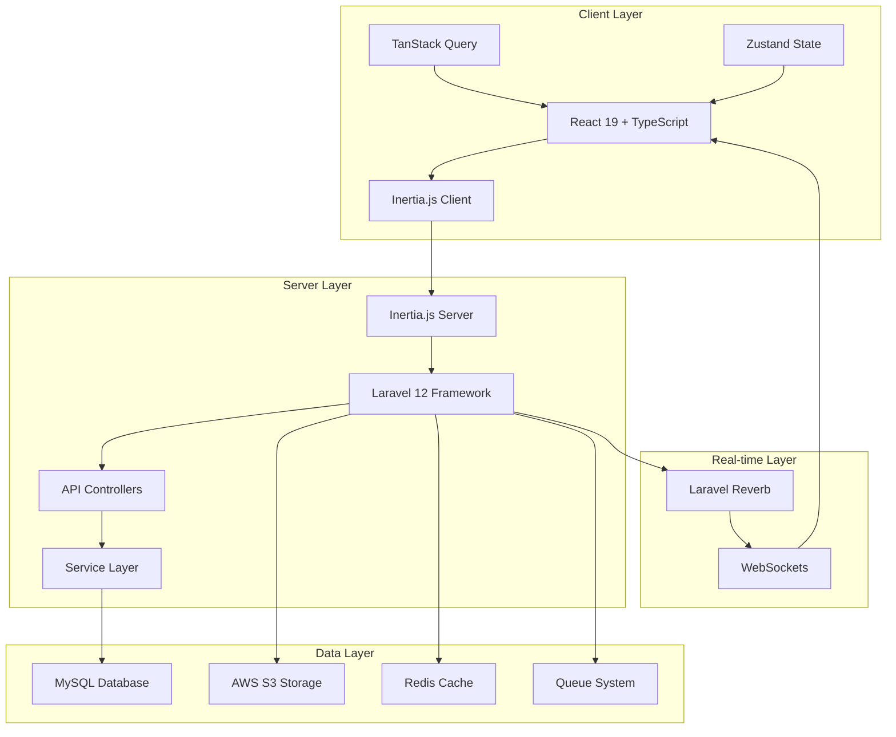
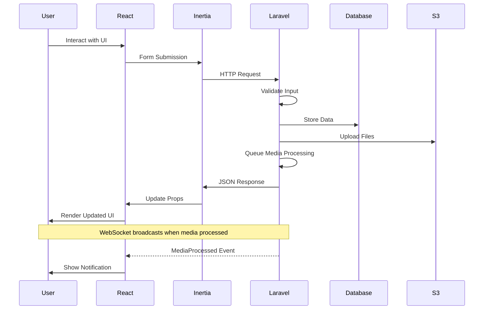

## Introduction

EduStack Smart is a modern full-stack web application built with Laravel 12 and React 19, utilizing Inertia.js for seamless server-client communication. The application follows a monolithic architecture with clear separation between backend and frontend concerns.

## System Architecture



## Technology Stack

### Backend

<CardGroup cols={2}>
  <Card title="Core Framework" icon="code">
    - **Laravel 12** - PHP framework with modern features
    - **PHP 8.2+** - Latest PHP version with type safety
  </Card>
  
  <Card title="Authentication" icon="lock">
    - **Laravel Fortify** - Authentication backend
    - **Laravel Sanctum** - API token authentication
    - Two-factor authentication support
  </Card>
  
  <Card title="Real-time & Queue" icon="broadcast-tower">
    - **Laravel Reverb** - WebSocket server
    - **Pusher** - Broadcasting driver
    - Database queue driver
  </Card>
  
  <Card title="Media & Permissions" icon="image">
    - **Spatie Media Library** - File management
    - **Spatie Permission** - Role-based access control
    - **AWS S3** - Cloud storage
  </Card>
</CardGroup>

### Frontend

<CardGroup cols={2}>
  <Card title="Core Technologies" icon="react">
    - **React 19** - Latest React with concurrent features
    - **TypeScript** - Type-safe JavaScript
    - **Inertia.js 2.0** - Modern monolith approach
  </Card>
  
  <Card title="UI & Styling" icon="palette">
    - **Tailwind CSS 4** - Utility-first CSS
    - **Radix UI** - Headless component primitives
    - **Framer Motion** - Animation library
  </Card>
  
  <Card title="State & Data" icon="database">
    - **TanStack Query** - Server state management
    - **Zustand** - Client state management
    - **React Hook Form** - Form management
  </Card>
  
  <Card title="Rich Features" icon="sparkles">
    - **TipTap** - Rich text editor
    - **Puck** - Visual page builder
    - **Leaflet** - Interactive maps
  </Card>
</CardGroup>

### Build Tools

- **Vite 7** - Lightning-fast build tool
- **Laravel Wayfinder** - Type-safe routing
- **ESLint & Prettier** - Code quality and formatting

## Core Features

### Content Management

The application provides robust content management capabilities:

- **Blog Posts** - Create, edit, and publish articles with rich media
- **Projects** - Showcase development projects with collaborators
- **Events** - Manage educational events with activities and registrations

From `app/Models/Post.php:16`:
```php
protected $fillable = [
    'name',
    'slug',
    'summary',
    'content',
    'views_count',
    'is_featured',
    'is_published',
    'published_at',
    'post_type_id',
    'user_id',
];
```

### Role-Based Access Control

Implements a flexible permission system using Spatie Permission package:

- **Admin** - Full system access
- **Member** - Content creation and management
- **Teacher** - Educational content access
- **Student** - Limited access to learning materials
- **Guest** - Public content only

From `resources/js/types/index.ts:7`:
```typescript
export enum RoleEnum {
    Guest = 'guest',
    Student = 'student',
    Teacher = 'teacher',
    Member = 'member',
    Admin = 'admin',
}
```

### Media Processing

Asynchronous media processing with real-time updates:

- Upload to AWS S3
- Generate responsive images
- Create thumbnails and conversions
- Broadcast processing completion via WebSockets

From `app/Providers/AppServiceProvider.php:30`:
```php
Event::listen(ConversionHasBeenCompletedEvent::class, function ($event) {
    $media = $event->media;
    
    if ($media->model_type === Post::class) {
        broadcast(new MediaProcessed($media->model_id, 'post'));
    }
});
```

## Request Flow



## Key Architectural Decisions

### Monolithic Approach with Inertia.js

<Info>
Inertia.js allows building modern single-page applications using server-side routing and controllers, eliminating the need for a separate API layer for the frontend.
</Info>

From `resources/js/app.tsx:24`:
```typescript
createInertiaApp({
    title: (title) => (title ? `${title} - ${appName}` : appName),
    resolve: (name) =>
        resolvePageComponent(
            `./pages/${name}.tsx`,
            import.meta.glob('./pages/**/*.tsx'),
        ),
    // ...
});
```

### Type Safety Across Stack

Both backend (PHP 8.2+) and frontend (TypeScript) leverage strong typing:

- Laravel IDE Helper for PHP type hints
- TypeScript strict mode enabled
- Laravel Wayfinder for type-safe routing

### Event-Driven Architecture

Utilizes Laravel's event system for decoupled, scalable operations:

- Media processing events
- User activity notifications
- Real-time broadcasts via WebSockets

### Resource-Based API Responses

Consistent data transformation using Laravel Resources:

From `app/Http/Resources/PostResource.php`:
```php
public function toArray(Request $request): array
{
    return [
        'id' => $this->id,
        'name' => $this->name,
        'slug' => $this->slug,
        // ... transformed data
    ];
}
```

## Performance Optimizations

<AccordionGroup>
  <Accordion title="Database Query Optimization">
    - Eager loading relationships to avoid N+1 queries
    - Database indexing on frequently queried columns
    - Pagination for large datasets (20 items per page)
  </Accordion>
  
  <Accordion title="Asset Optimization">
    - Vite for optimized frontend builds
    - Code splitting with React lazy loading
    - Image optimization via Spatie Media Library
    - Responsive images with multiple sizes
  </Accordion>
  
  <Accordion title="Caching Strategy">
    - Redis for session and cache storage
    - Query result caching
    - Route caching in production
  </Accordion>
  
  <Accordion title="Queue Management">
    - Background processing for heavy operations
    - Media conversion in queues
    - Email sending via queues
  </Accordion>
</AccordionGroup>

## Security Features

- **CSRF Protection** - Built-in Laravel CSRF tokens
- **XSS Prevention** - React automatic escaping
- **SQL Injection Protection** - Eloquent ORM
- **Authentication** - Fortify with 2FA support
- **Authorization** - Permission-based access control
- **API Security** - Sanctum token authentication

## Scalability Considerations

<Steps>
  <Step title="Horizontal Scaling">
    Stateless application design allows multiple server instances behind a load balancer
  </Step>
  
  <Step title="Database Scaling">
    Supports read replicas and can migrate to distributed databases
  </Step>
  
  <Step title="File Storage">
    AWS S3 provides unlimited scalable storage
  </Step>
  
  <Step title="Queue Workers">
    Multiple queue workers can be deployed for parallel processing
  </Step>
</Steps>

## Development Workflow

From `composer.json:68`:
```json
"dev": [
    "Composer\\Config::disableProcessTimeout",
    "npx concurrently -c \"#93c5fd,#c4b5fd,#fdba74\" \"php artisan serve\" \"php artisan queue:listen --tries=1\" \"pnpm run dev\" --names='server,queue,vite'"
]
```

Development environment runs three concurrent processes:
1. Laravel development server (port 8000)
2. Queue worker for background jobs
3. Vite dev server with HMR

<Note>
SSR (Server-Side Rendering) mode is also available for improved SEO and initial page load performance.
</Note>

## Next Steps

<CardGroup cols={2}>
  <Card title="Backend Architecture" icon="server" href="/architecture/backend">
    Dive deep into Laravel structure, API design, and service layer
  </Card>
  
  <Card title="Frontend Architecture" icon="react" href="/architecture/frontend">
    Explore React components, state management, and TypeScript setup
  </Card>
  
  <Card title="Database Schema" icon="database" href="/architecture/database">
    Understand data models, relationships, and migrations
  </Card>
</CardGroup>