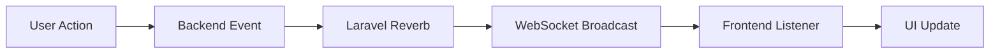

# Introduction to EduStack Smart

EduStack Smart is a modern academic platform designed under a **Research + Technological Development (R+D)** approach to centralize institutional management, project traceability, and intelligent educational assistance.

## What is EduStack Smart?

EduStack Smart is an enterprise-grade academic management platform that combines cutting-edge web technologies with local artificial intelligence to provide a comprehensive solution for academic institutions. Built with a decoupled, API-first architecture, it enables institutions to manage users, projects, events, content, and educational resources efficiently.

<Note>
  EduStack Smart implements AI models that run directly in the browser using WebLLM and WebGPU, ensuring privacy and low latency without external API dependencies.
</Note>

## Key Capabilities

### Modern Architecture

The platform is built on a robust technical foundation:

- **API Headless Design** - Decoupled backend and frontend for maximum flexibility
- **Hybrid SSR** - Server-side rendering with selective hydration for optimal performance
- **Granular RBAC** - Role-based access control with fine-grained permissions
- **Asynchronous Processing** - Queue-based background jobs for heavy operations
- **Real-time Communication** - WebSocket integration via Laravel Reverb
- **Local AI Execution** - Browser-based LLM inference for privacy and speed

### Core Features

<CardGroup cols={2}>
  <Card title="Secure Authentication" icon="lock">
    Token-based authentication with Laravel Sanctum, two-factor support, and CSRF protection
  </Card>
  
  <Card title="Project Management" icon="diagram-project">
    Complete project lifecycle management with SemVer versioning and collaboration tools
  </Card>
  
  <Card title="Content Management" icon="newspaper">
    Institutional blog with categories, types, and multimedia support
  </Card>
  
  <Card title="Event Administration" icon="calendar">
    Event and activity management with types, categories, and scheduling
  </Card>
  
  <Card title="Classroom Platform (LMS)" icon="chalkboard-user">
    Learning management system for courses and educational content (in development)
  </Card>
  
  <Card title="Analytics Dashboard" icon="chart-line">
    Institutional analytics and reporting tools (in development)
  </Card>
</CardGroup>

## Technology Stack

### Backend (Core API)

- **PHP 8.3** - Modern PHP with strong typing and performance improvements
- **Laravel 12** - Latest version of the leading PHP framework
- **PostgreSQL/SQLite** - Robust relational database support
- **Redis** - In-memory caching and session storage
- **Laravel Sanctum** - SPA authentication
- **Laravel Reverb** - Native WebSocket server
- **Spatie MediaLibrary** - Advanced multimedia processing

<Info>
  The backend follows Clean Architecture principles with a Service Layer Pattern and Event-Driven Architecture for maintainability and scalability.
</Info>

### Frontend - Public Website

- **Astro** - Modern SSR framework with Island Architecture
- **React** - UI components via Astro Islands
- **TypeScript** - Type-safe JavaScript
- **View Transitions API** - Smooth page transitions

**Optimizations:**
- Server-side rendering for SEO and performance
- Selective hydration for minimal JavaScript
- Lazy loading of components
- Minimal JS bundle size

### Frontend - Admin Panel

- **Laravel + Inertia.js + React** - Modern monolithic SPA experience
- **Radix UI** - Accessible component primitives
- **Tailwind CSS 4** - Utility-first styling
- **TipTap** - Rich text editor
- **React Query** - Server state management
- **Zustand** - Client state management

## Role-Based Access Control (RBAC)

EduStack Smart implements a comprehensive permission system with five user roles:

| Role | Access Level | Permissions |
|------|--------------|-------------|
| 🔐 **Admin** | Full control | System configuration, user management, all modules |
| 👤 **Member** | Content management | Blog posts and event management |
| 👨‍🏫 **Teacher** | Educational | Project oversight and classroom management |
| 🎓 **Student** | Participation | Project collaboration and classroom access |
| 👀 **Visitor** | Public only | Read-only access to public content |

Access control is enforced through:
- Middleware for route protection
- Policies for model authorization
- Query scoping for data access
- Endpoint-level validation

## Use Cases for Academic Institutions

### Research & Development

- Track technological research projects with version control
- Manage project collaborators and roles
- Document project evolution with SemVer releases
- Share project outcomes institutionally

### Educational Management

- Create and manage courses through the LMS module
- Organize academic events and activities
- Coordinate institutional calendars
- Provide AI-assisted tutoring and feedback

### Content Publishing

- Publish institutional news and announcements
- Categorize content by type and subject
- Handle multimedia content with optimized processing
- Maintain an institutional blog

### Institutional Administration

- Manage users with granular role assignments
- Monitor system analytics and usage patterns
- Configure institutional settings and branding
- Control access to resources by role

## Local AI Capabilities

EduStack Smart integrates Large Language Models (LLMs) that run directly in the browser using **WebLLM** and **WebGPU** technology.

### AI Use Cases

<AccordionGroup>
  <Accordion title="Contextual Tutoring">
    AI provides personalized assistance based on the student's current context and learning materials.
  </Accordion>
  
  <Accordion title="Automatic Summarization">
    Generate concise summaries of long documents, lectures, or project documentation.
  </Accordion>
  
  <Accordion title="Question Generation">
    Automatically create quiz questions and study materials from course content.
  </Accordion>
  
  <Accordion title="Code Explanation">
    Break down and explain code snippets for programming courses and projects.
  </Accordion>
  
  <Accordion title="Technical Feedback">
    Provide immediate feedback on student submissions and technical work.
  </Accordion>
</AccordionGroup>

### AI Advantages

- ✅ **Local Inference** - All processing happens in the user's browser
- ✅ **Enhanced Privacy** - No data sent to external AI services
- ✅ **Low Latency** - Instant responses without network delays
- ✅ **No External Dependencies** - Works offline once models are loaded
- ✅ **Cost Effective** - No API costs for AI features

## Real-Time Features

EduStack Smart uses **Laravel Reverb** for WebSocket communication, enabling:

- Live notifications for users
- Real-time project status updates
- Event and activity updates
- UI updates without page refresh
- Live collaboration features

## Multimedia Processing

The platform handles multimedia content efficiently through an asynchronous workflow:

<Steps>
  <Step title="Upload">
    User uploads media files through the interface
  </Step>
  
  <Step title="Storage">
    Files are stored using Spatie MediaLibrary with metadata
  </Step>
  
  <Step title="Queue Dispatch">
    Conversion jobs are dispatched to the queue
  </Step>
  
  <Step title="Processing">
    Background workers process and optimize media
  </Step>
  
  <Step title="Status Update">
    Processing status is updated in the database
  </Step>
  
  <Step title="WebSocket Notification">
    User receives real-time notification of completion
  </Step>
</Steps>

This prevents blocking the HTTP thread and improves overall performance.

## Security Features

<Warning>
  EduStack Smart implements enterprise-grade security measures to protect institutional data.
</Warning>

- **Token-based Authentication** - Secure SPA authentication with Laravel Sanctum
- **CSRF Protection** - Cross-site request forgery prevention
- **Rate Limiting** - Protection against brute force attacks
- **Strict Validation** - Input validation on all endpoints
- **Granular Role Control** - Fine-grained access permissions
- **Data Compliance** - Built with data protection regulations in mind

## Scalability & Performance

The platform is designed to grow with your institution:

- **Decoupled Backend** - API can be scaled independently
- **Queue-based Processing** - Heavy operations don't block user requests
- **Independent WebSockets** - Reverb server scales separately
- **Docker-ready** - Containerization support for easy deployment
- **Microservices-ready** - Architecture prepared for future service splitting
- **CDN Support** - Static assets can be served from CDN
- **Database Optimization** - Efficient queries and caching strategies

## Next Steps

<CardGroup cols={2}>
  <Card title="Quick Start" icon="rocket" href="/quickstart">
    Get EduStack Smart running in minutes
  </Card>
  
  <Card title="Installation Guide" icon="download" href="/installation">
    Detailed installation instructions for production
  </Card>
  
  <Card title="API Reference" icon="code" href="/api/overview">
    Explore the API documentation
  </Card>
  
  <Card title="Configuration" icon="gear" href="/development/environment">
    Configure the platform for your institution
  </Card>
</CardGroup>

---

**Built by**: Diego Meneses Pérez | Full Stack Developer | Modern Architecture | Applied AI
